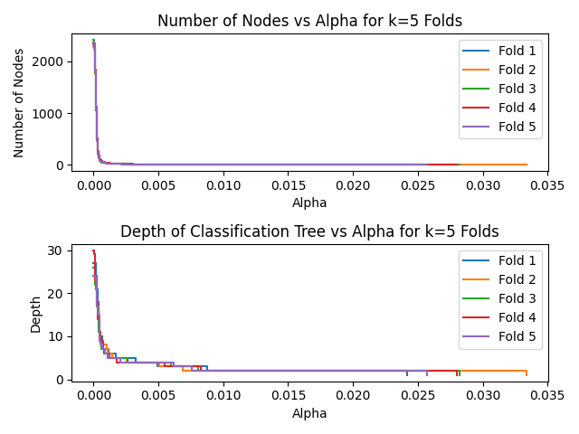
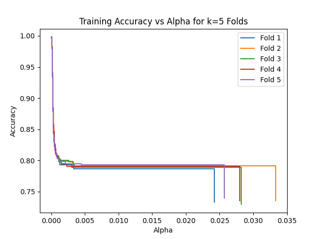

```{r setup, include=FALSE}
knitr::opts_chunk$set(echo = TRUE)
```

## Dataset

The Telco Customer Churn datset, provided by IBM, contains information about a fictional telecommunications (telco) company which provided home phone and internet services to 7043 customers. The dataset provides demographic and business-related metrics for each customer, as well as identifying whether the customer switched providers (customer churn).

The dataset can be downloaded from the following link: <https://accelerator.ca.analytics.ibm.com/bi/?perspective=authoring&pathRef=.public_folders%2FIBM%2BAccelerator%2BCatalog%2FContent%2FDAT00067>

The dataset contains 33 variables for 7043 observations, but not all variables are fit to be predictive features. We removed columns relating to unique IDs, geographical information, and dashboarding aggregation, as well as "duplicate" columns (those that are identical to another column except for formatting), and columns related to the response (such as the churn reason and predicted lifetime value to the company).

We are then left with 19 features, listed below. The descriptions of the features are adapted from <https://community.ibm.com/community/user/businessanalytics/blogs/steven-macko/2019/07/11/telco-customer-churn-1113>:
- Gender: The customer’s gender: Male, Female
- Senior Citizen: Indicates if the customer is 65 or older: Yes, No
- Partner: Indicates if the customer is married: Yes, No
- Dependents: Indicates if the customer lives with any dependents: Yes, No Dependents could be children, parents, grandparents, etc.
- Tenure Months: Indicates the total amount of months that the customer has been with the company
- Phone Service: Indicates if the customer subscribes to home phone service with the company: Yes, No
- Multiple Lines: Indicates if the customer subscribes to multiple telephone lines with the company: Yes, No
- Internet Service: Indicates if the customer subscribes to Internet service with the company: No, DSL, Fiber Optic, Cable
- Online Security: Indicates if the customer subscribes to an additional online security service provided by the company: Yes, No
- Online Backup: Indicates if the customer subscribes to an additional online backup service provided by the company: Yes, No
- Device Protection Plan: Indicates if the customer subscribes to an additional device protection plan for their Internet equipment provided by the company: Yes, No
- Tech Support: Indicates if the customer subscribes to an additional technical support plan from the company with reduced wait times: Yes, No
- Streaming TV: Indicates if the customer uses their Internet service to stream television programming from a third party provider: Yes, No. The company does not charge an additional fee for this service
- Streaming Movies: Indicates if the customer uses their Internet service to stream movies from a third party provider: Yes, No. The company does not charge an additional fee for this service
- Contract: Indicates the customer’s current contract type: Month-to-Month, One Year, Two Year
- Paperless Billing: Indicates if the customer has chosen paperless billing: Yes, No
- Payment Method: Indicates how the customer pays their bill: Bank Withdrawal, Credit Card, Mailed Check
- Monthly Charge: Indicates the customer’s current total monthly charge for all their services from the company
- Total Charges: Indicates the customer’s total charges, calculated to the end of the quarter

Finally, the response variable:
- Churn Value: 1 = the customer left the company this quarter; 0 = the customer remained with the company

## Exploratory Data Analysis

## Classification Methods

## Preliminary Results

{width=360px} {width=360px}

{width=245px} {width=245px} {width=245px}

## Appendix