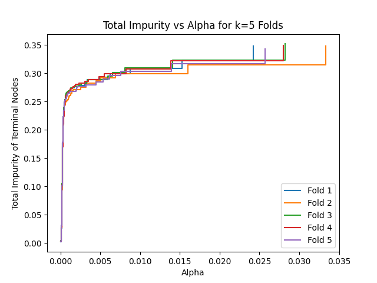

```{r setup, include=FALSE}
knitr::opts_chunk$set(echo = TRUE)
```

# Dataset
The Telco Customer Churn datset, provided by IBM, contains information about a fictional telecommunications (telco) company which provided home phone and internet services to 7043 customers. The dataset provides demographic and business-related metrics for each customer, as well as identifying whether the customer switched providers (customer churn).

The dataset can be downloaded from the following link: <https://accelerator.ca.analytics.ibm.com/bi/?perspective=authoring&pathRef=.public_folders%2FIBM%2BAccelerator%2BCatalog%2FContent%2FDAT00067>

The dataset contains **33** variables for **7043** observations, but not all variables are fit to be predictive features. We removed columns relating to unique IDs, geographical information, and dashboarding aggregation, as well as "duplicate" columns (those that are identical to another column except for formatting), and columns related to the response (such as the churn reason and predicted lifetime value to the company).

We are then left with **19** features: Gender, Senior Citizen, Partner, Dependents, Tenure Months (integer/numeric), Phone Service, Multiple Lines, Internet Service, Online Security, Online Backup, Device Protection Plan, Tech Support, Streaming TV, Streaming Movies, Contract, Paperless Billing, Payment method, Monthly Charge (float/numeric), and Total Charges (float/numeric). Each feature is categorical except those specified otherwise. The descriptions of the features can be found at <https://community.ibm.com/community/user/businessanalytics/blogs/steven-macko/2019/07/11/telco-customer-churn-1113>.

Finally, the response variable is Churn Value, binary on whether the customer left the company this quarter.

# Exploratory Data Analysis
We started out with some EDA to understand the data before applying any machine learning techniques.
We noticed that the data is imbalanced; **73%** of the data is labelled as No whereas **27%** is labelled Yes for churn, so we might have to choose our resampling methods to ensure that our training data is not biased.


Notice from the graph that there is a clear relationship between Senior citizens = Yes and the total charges they have. Senior citizens seem to be paying extra than non senior citizens, and customers that tend to pay by mailed check pay less than those who do bank transfers.

Furthermore, from our Boxplots and distribution we notice that the underlying charges are not distributed uniformly. And the total charges, although calculated with the monthly charges, do not have exactly the same distributions and are more left skewed than the Monthly charges. This may be the result of new customers who have not yet had multiple monthly charges for their total (quarterly) charge.


# Classification Methods
We would like to compare the predictive accuracy of the more complex/computationally intensive models with the predictive accuracy of the more straightforward/computationally simple models. We plan to set aside some of the dataset as “new data” for this purpose; all of the models will train on the same subset of the dataset (called the visible data) and never see the “new data”. This way, we have a fair comparison of predictive power across all of the different models.

1. **Logistic Regression**: This is a widely used linear regression model for binary classification problems and it is less prone to overfitting. We will use scikit-learn to build our implementation. To calibrate the model, we can tune the regularization parameter using cross-validation.

2. **Decision Trees**: A decision tree algorithm can be used to classify customers as churners or non-churners based on a set of features. We will use scikit-learn to build our implementation. We can tune parameters like the maximum depth of the tree and the minimum number of samples required to split a node, as well as the cost complexity pruning parameter alpha and the number of folds used for cross validation. This algorithm is prone to overfitting if there is too much depth.

3. **Random Forests**: This is an ensemble learning algorithm that creates multiple decision trees (as above) and aggregates their predictions. We will use scikit-learn to build our implementation. We can tune parameters like the number of trees in the forest, the maximum depth of the trees, and the number of features considered for each split.

4. **Support Vector Machines (SVMs)**: SVMs are particularly useful when the number of features is high relative to the number of observations, as they can handle high-dimensional data well. They try to find a hyperplane that separates the churners from the non-churners. SVMs are implemented in libraries such as scikit-learn in Python with the SVC class . We can tune parameters like the kernel type, the regularization parameter, and the kernel coefficient. With our EDA we can figure out if there is a higher number of outliers and use hard or soft margins, since we have a lot of features SVM is a good choice. The SVC class takes several parameters, including the type of kernel to use (linear, polynomial), the regularization parameter (C), and the kernel coefficient (gamma for RBF kernel, degree for polynomial kernel).

5. **K-Nearest Neighbors (KNN)**: This is a non-parametric algorithm that classifies a new data point based on the k-nearest points in the training data. KNN is implemented in libraries such as scikit-learn in Python and we can use k-fold cross validation to calculate the best ‘k’. We can tune parameters like the number of neighbors (k) and the distance metric.

6. **Neural Networks**: Neural networks are a popular algorithm for classification problems for non-linear data. We will implement this using TensorFlow in Python. Since the dataset has a large number of training data this algorithm is a good choice. We can tune parameters like the number of layers, the number of neurons in each layer, and the activation functions.

After testing multiple models for accuracy, the next step is to select the best model based on its performance on the validation set. The validation set is used to estimate the performance of each model on unseen data, which is a better estimate of the model's true performance than the training set.
Once the best model has been selected, we will retrain the model on the entire (visible) dataset to get maximum predictive performance.

# Preliminary Results
For our preliminary results, we fit two different models which we will use two of the computationally simple models to compare against. We used one-hot encoding to encode the categorical features, where each category except the baseline becomes a new binary feature.

Our first model is a Decision Tree (aka Classification Tree), built using Recursive Binary Splitting on the entire dataset. Then we used Cost Complexity Pruning and k-fold cross-validation (with k=5) to find the optimal value for alpha which defines a subtree.
We can produce 5 metrics for each of the folds as a function of the cost complexity parameter alpha: the total impurity of leaf/terminal nodes, the number of nodes in the tree, the depth of the tree, the training accuracy, and the testing accuracy. Finally, we can also produce the average testing accuracy across the 5 folds.

`\hspace{3cm}`{=latex} {width=245px} {width=245px}
{width=245px} {width=245px} {width=245px}

Our second model is a simple SVM that uses 90% of the pre-processed dataset to train the SVM classifier from scikit-learn. We fit the model on 4 different SVM models with different hyperparameters:
```{r table2, echo=FALSE, message=FALSE, warnings=FALSE, results='asis'}
tabl <- "
| Models        | Regularization parameter | Kernel  | Accuracy|
|---------------|:-------------:|------:|------:|
| SVM 1      | default | None | 0.7585|
| SVM 2      | 100      |   None | 0.8011|
| SVM 3 | 100      |    polynomial | 0.7585|
| SVM 4 | 100      |    sigmoid | 0.6264|
"
cat(tabl) # output the table in a format good for HTML/PDF/docx conversion
```

\newpage
# Appendix
## Other Analyses on the same dataset
Our dataset is also popular on Kaggle. The following link shows 21 other analyses of the same dataset: <https://www.kaggle.com/datasets/yeanzc/telco-customer-churn-ibm-dataset/code>
The vast majority of these analyses are plug-and-play, where default classifiers are run on the dataset, and then the results are analyzed and visualized in many ways.
Most of the analyses use at least one of Logistic Regression, Naive Bayes, Random Forest, or XGBoost, and most of the hyperparameters are tuned using out of the box tools. Only one analysis used (explicit) cross-validation at all.

Our methods will heavily use cross-validation where possible (for the simpler models), and we are planning to implement more complex models such as Neural Networks and KNN. Additionally, we are planning to compare the predictive power across all of our models, taking into account the complexity and computational requirements for each model.

## Decision Tree Code
```{python, eval=FALSE, echo=TRUE, python.reticulate=FALSE}
from collections import namedtuple

import matplotlib.pyplot as plt
from sklearn import model_selection, tree
import pandas as pd


# Load data
df = pd.read_excel("Telco_customer_churn.xlsx")
df = df.drop(columns=[
    "CustomerID", "Count", "Country", "State", "City", "Zip Code", "Lat Long",
    "Latitude", "Longitude", "Churn Label", "Churn Score", "CLTV",
    "Churn Reason",
    "Total Charges"  # Missing values, add back later?
])

# No need to change types to categorical, as one-hot encoding handles that

# Isolate Features and Response
X = df.drop(columns=["Churn Value"])
Y = df["Churn Value"]
onehot_X = pd.get_dummies(X, drop_first=True)

# Split data
n_splits = 5
kf = model_selection.KFold(n_splits=n_splits, shuffle=True, random_state=441)

# Create fold variables to store data
FoldResults = namedtuple("FoldResults", [
    "ccp_alphas", "impurities", "node_counts", "depth",
    "train_scores", "test_scores"
])
folds = []

# k-fold CV
for train, test in kf.split(onehot_X):
    print("Testing...")
    X_train, X_test = onehot_X.iloc[train], onehot_X.iloc[test]
    y_train, y_test = Y.iloc[train], Y.iloc[test]

    # Create Decision Tree, use Cost Complexity Pruning
    clf = tree.DecisionTreeClassifier(random_state=441)
    path = clf.cost_complexity_pruning_path(X_train, y_train)
    ccp_alphas, impurities = path.ccp_alphas[:-1], path.impurities[:-1]

    # Train a DTree with each alpha
    clfs = []
    for ccp_alpha in ccp_alphas:
        clf = tree.DecisionTreeClassifier(
            random_state=441, ccp_alpha=ccp_alpha)
        clf.fit(X_train, y_train)
        clfs.append(clf)

    # Compute metrics
    node_counts = [clf.tree_.node_count for clf in clfs]
    depth = [clf.tree_.max_depth for clf in clfs]
    train_scores = [clf.score(X_train, y_train) for clf in clfs]
    test_scores = [clf.score(X_test, y_test) for clf in clfs]

    # Save fold results
    folds.append(FoldResults(
        ccp_alphas, impurities, node_counts, depth, train_scores, test_scores
    ))

# Impurity vs Alphas
fig, ax = plt.subplots()
for i in range(n_splits):
    ax.plot(
        folds[i].ccp_alphas, folds[i].impurities, marker=",",
        label=f"Fold {i+1}", drawstyle="steps-post"
    )
ax.set_xlabel("Alpha")
ax.set_ylabel("Total Impurity of Terminal Nodes")
ax.set_title(f"Total Impurity vs Alpha for k={n_splits} Folds")
ax.legend()

# Graph number of nodes and depth vs alpha
fig, ax = plt.subplots(2, 1)
for i in range(n_splits):
    ax[0].plot(
        folds[i].ccp_alphas, folds[i].node_counts, marker=",",
        label=f"Fold {i+1}", drawstyle="steps-post"
    )
ax[0].set_xlabel("Alpha")
ax[0].set_ylabel("Number of Nodes")
ax[0].set_title(f"Number of Nodes vs Alpha for k={n_splits} Folds")
ax[0].legend()
for i in range(n_splits):
    ax[1].plot(
        folds[i].ccp_alphas, folds[i].depth, marker=",",
        label=f"Fold {i+1}", drawstyle="steps-post"
    )
ax[1].set_xlabel("Alpha")
ax[1].set_ylabel("Depth")
ax[1].set_title(f"Depth of Classification Tree vs Alpha for k={n_splits} Folds")
ax[1].legend()
fig.tight_layout()

# Graph training accuracy vs alpha
fig, ax = plt.subplots()
ax.set_xlabel("Alpha")
ax.set_ylabel("Accuracy")
ax.set_title("Training Accuracy vs Alpha for k=5 Folds")
for i in range(n_splits):
    ax.plot(
        folds[i].ccp_alphas, folds[i].train_scores, marker=",",
        label=f"Fold {i+1}", drawstyle="steps-post"
    )
ax.legend()

# Graph testing accuracy vs alpha
fig, ax = plt.subplots()
ax.set_xlabel("Alpha")
ax.set_ylabel("Accuracy")
ax.set_title(f"Testing Accuracy vs Alpha for k={n_splits} Folds")
for i in range(n_splits):
    ax.plot(
        folds[i].ccp_alphas, folds[i].test_scores, marker=",",
        label=f"Fold {i+1}", drawstyle="steps-post"
    )
ax.legend()

# Compute average testing accuracy for all alphas
all_alphas = sorted(set(
    sum([list(folds[i].ccp_alphas) for i in range(n_splits)], [])
))

avg_test_scores = []
a_ind = [0 for _ in range(n_splits)]
for alpha in all_alphas:
    a_sum = 0
    for i in range(n_splits):
        while a_ind[i] + 1 < len(folds[i].ccp_alphas):
            if folds[i].ccp_alphas[a_ind[i] + 1] < alpha:
                a_ind[i] += 1
            else:
                break
        a_sum += folds[i].test_scores[a_ind[i]]
    avg_test_scores.append(a_sum/n_splits)

# Graph average testing accuracy vs alpha
fig, ax = plt.subplots()
ax.set_xlabel("Alpha")
ax.set_ylabel("Accuracy")
ax.set_title(f"Average Accuracy vs Alpha for k={n_splits} Testing Sets")
ax.plot(
    all_alphas, avg_test_scores, marker=".", drawstyle="steps-post"
)

# Show all plots
plt.show()

# Compute best alpha
max_test = max(avg_test_scores)
where_max = avg_test_scores.index(max_test)
best_alpha = all_alphas[where_max]
print(max_test, where_max, best_alpha)
# Out: 0.79894862168527 1265 0.0006430489816063728
```

## SVM Code
```{python, eval=FALSE, echo=TRUE, python.reticulate=FALSE}
import pandas as pd
import matplotlib.pyplot as plt
import numpy as np
import seaborn as sns
from sklearn.svm import SVC

# import metrics to compute accuracy
from sklearn.metrics import accuracy_score


from sklearn.model_selection import train_test_split
from sklearn.metrics import confusion_matrix, classification_report


df = pd.read_excel('/content/Telco_customer_churn.xlsx')
df.head()


df.columns = df.columns.str.replace(' ', '')
df['Churn Label'].value_counts()/np.float(len(df))


dd  = df.loc[df['TotalCharges'] != ' '] # removing rows with no total charges
dd['TotalCharges'] = dd['TotalCharges'].astype('float')
X = dd.drop(['ChurnLabel','CustomerID','Count','Country','State','City',
'ZipCode','LatLong','Latitude','Longitude',
'ChurnValue','ChurnScore','CLTV','ChurnReason'], axis=1)
#one hot encoding
dd['ChurnLabel'] = dd['ChurnLabel'].replace(to_replace = ['Yes','No'],value = ['1','0'])
X = pd.get_dummies(X)
y = dd['ChurnLabel']


#split train and test

X_train, X_test, y_train, y_test = train_test_split(X, y, test_size = 0.1, random_state = 0)
X_train.shape, X_test.shape


svc=SVC() 
svc.fit(X_train,y_train)
y_pred=svc.predict(X_test)
print('Model accuracy score with default hyperparameters: \
 {0:0.4f}'. format(accuracy_score(y_test, y_pred)))

svc=SVC(C=100)
svc.fit(X_train,y_train)
y_pred=svc.predict(X_test)
print('Model accuracy score with C = 100: \
 {0:0.4f}'. format(accuracy_score(y_test, y_pred)))

svc=SVC(kernel='poly',C=100)
svc.fit(X_train,y_train)
y_pred = svc.predict(X_test)
print('Model accuracy score with C = 100: \
{0:0.4f} and polynomial kernal'. format(accuracy_score(y_test, y_pred)))

svc=SVC(kernel='sigmoid',C=100)
svc.fit(X_train,y_train)
y_pred=svc.predict(X_test)
print('Model accuracy score with C = 100: \
 {0:0.4f} and sigmoid kernal'. format(accuracy_score(y_test, y_pred)))


#Model accuracy score with default hyperparameters: 0.7585
#Model accuracy score with C = 100: 0.8011
#Model accuracy score with C = 100: 0.7585 and polynomial kernal
#Model accuracy score with C = 100: 0.6264 and sigmoid kernal
```
