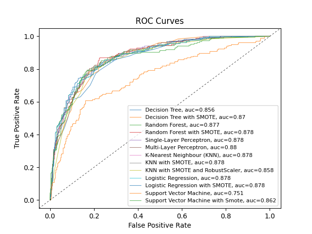

```{r setup, include=FALSE}
knitr::opts_chunk$set(echo = TRUE)
```

# Summary
For-profit businesses are always searching for ways to increase profits and retain paying customers. With the growing availability of statistical modelling, many businesses can leverage these tools to evaluate key metrics of their revenue, one of which is customer churn. This report seeks to compare multiple statistical models in their predictive ability and computational complexity, as well as the effect of certain preprocessing steps such as SMOTE. In particular, we evaluate Logistic Regression, Support vector Machines, K-Nearest Neighbours, Decision Trees, Random Forest, and Multi-Layer Perceptron models on the IBM Telco dataset. This report finds that all of the tested classifiers perform similarly on the same dataset, but that SMOTE tends to improve the prediction accuracy on the response of interest. This report also finds that the tested classifiers generally perform better than existing analyses using similar models.

# Introduction
Customer Churn is a business term used to describe the turnover (or churn) of customers who are doing business with a company. It should be obvious that for a profit-motivated business, the loss of customers and/or the frequent turnover of customers may be undesirable. Lost customers means less revenue, and long-term customers can be an asset to the company through word-of-mouth marketing and public reputation.

Besides the loss in profits, it often costs more for a company to acquire new customers rather than retain their existing customers, so businesses stand to save money if they can identify reasons why customers are leaving and address those issues. However, even if we cannot identify specific reasons, if it is possible to identify customers who may be at a higher risk of churn, the business may still benefit from targeting those customers by incentivizing them to stay. Of course, the methods by which those businesses target those customers may be below board, but that is far beyond the scope of this report.

One industry in which there is significant turnover is the telecommunications industry. The authors themselves have firsthand experience with the frustrations of changing internet and phone providers, and would like to mention that they cannot endorse intentionally creating barriers to exit and setting up multiple subsidiaries with different names as ethical strategies to counter customer churn.

Nevertheless, it may be possible to predict customer churn from quantitative customer data. This does not account for qualitative or unmeasured factors such as product dissatisfaction, corporate image, brand loyalty, and other similar factors.

Given qualitative customer data, we would like to compare the predictive ability of multiple statistical models on the same dataset, as well as explore some pre-processing techniques to improve accuracy.

## Dataset
The Telco Customer Churn dataset, provided by IBM, contains information about a fictional telecommunications (telco) company which provided home phone and internet services to 7043 customers. The dataset provides demographic and business-related metrics for each customer, as well as identifying whether the customer switched providers (customer churn).

The dataset can be downloaded from the following link: <https://accelerator.ca.analytics.ibm.com/bi/?perspective=authoring&pathRef=.public_folders%2FIBM%2BAccelerator%2BCatalog%2FContent%2FDAT00067>

The dataset contains **33** variables for **7043** observations, but not all variables are fit to be predictive features. We removed columns relating to unique IDs, geographical information, and dashboarding aggregation, as well as "duplicate" columns (those that are identical to another column except for formatting), and columns related to the response (such as the churn reason and predicted lifetime value to the company).

We are then left with **19** features: Gender, Senior Citizen, Partner, Dependents, Tenure Months (integer/numeric), Phone Service, Multiple Lines, Internet Service, Online Security, Online Backup, Device Protection Plan, Tech Support, Streaming TV, Streaming Movies, Contract, Paperless Billing, Payment method, Monthly Charge (float/numeric), and Total Charges (float/numeric). Each feature is categorical except those specified otherwise. The descriptions of the features can be found at <https://community.ibm.com/community/user/businessanalytics/blogs/steven-macko/2019/07/11/telco-customer-churn-1113>.

Finally, the response variable is Churn Value, binary on whether the customer left the company this quarter.

## Exploratory Data Analysis (EDA)


There are some analyses from our EDA that are of note:

From Figures 1, 4, 5, 6, and 7 (see Appendix) we can infer several correlations: those who don't have tech support, device protection, and those with month-to-month contracts are likely to churn. This can be because the customer has not committed to the company, and so there is a correlation between these features.

From Figure 9 we can see that there are no clear outliers in the data, this is good because we can use classification methods like KNN and Logistic regression without worrying too much about the outliers causing the models to overfit.

Correlation can lead to multicollinearity, where two or more predictors in a model are highly correlated. This can result in unstable estimates of the coefficients and make it difficult to interpret the individual effect of each predictor. Multicollinearity can also reduce the model's predictive accuracy and lead to overfitting. According to Girish Chandrashekar [@CHANDRASHEKAR201416] "when two features are perfectly correlated, only one feature is sufficient to describe the data. The dependent variables provide no extra information about the classes and thus serve as noise for the predictor. This means that the total information content can be obtained from fewer unique features which contain maximum discrimination information about the classes. Hence by eliminating the dependent variables, the amount of data can be reduced which can lead to improvement in the classification performance." Thus the best way forward is to reduce correlated features by making new features that capture the data of the correlated features or eliminate them using dimensionality reduction techniques like Principal component analysis, Best subset selection etc. 

Correlation can lead to the inclusion of redundant information in the model. If two predictors are highly correlated, they may provide similar information to the model, and including both predictors may not improve the model's performance. This can result in unnecessarily complex models and reduce the model's interpretability.

# Methods
## Preprocessing
In our initial investigation, we identified which columns of the dataset we were going to use as features, as well as the label. We then determined the type of each feature, with all but three being categorical (including binary features), and the remainder being of unbounded numeric type. We then removed incomplete rows, leaving 7032 observations.

The preprocessing steps, including the train/test split, were done in a unified manner so that each model would be trained and tested on the exact same data, so that accurate comparisons can be made from the results. For use in a supervised classification task, we also introduced some additional preprocessing steps (not all of which are used by every model).

The first optional step is Synthetic Minority Over-sampling Technique (SMOTE) [@Chawla_2002]. SMOTE is an over-sampling method intended to reduce the bias towards the majority class in classification models by artificially creating new datapoints in the minority class. The authors of the SMOTE paper note that "the combination of SMOTE and under-sampling also performs better... than the methods that could directly handle the skewed class distribution". The minority class in our dataset represents approximately 24% of the entire population, so there may be a benefit for some models to apply SMOTE and under-sampling. This is implemented in our preprocessing using the imblearn package, of which we are using the SMOTENC (for datasets including categorical features) and RandomUnderSampler methods. For the rest of the report, SMOTE will refer to the combination of synthetic over-sampling and random under-sampling the training set.

The second step is the one-hot encoding step. All of our models required the categorical features to be one-hot encoded to interpret the data correctly. Each label in a categorical variate is turned into a new binary (numeric) variate representing the existence of that label, with the exception of the baseline label, represented as zeros across all of the new variates. For variates with only two labels, this is equivalent to interpreting it as a binary variate. This increases the number of features from 19 to 30.

The third optional step is feature scaling. For our three numeric features, all three are non-negative and unbounded, and some models perform better with bounded numerical values. Hence, the numeric features are rescaled to be between 0 and 1 inclusive.

All three preprocessing steps are applied independently to the training and testing sets to ensure no leakage occurs (specifically for SMOTE, but also for feature scaling). Additionally, all preprocessing steps and models are seeded whenever possible to ensure reproducibility and deterministic behavior.

## Logistic Regression
Logistic regression is a widely used algorithm in machine learning, especially for binary classification problems like churn cases. We modeled 2 logistic regression models using different feature engineering techniques; one with raw data and one with undersampling techniques.

To find the best hyperparameters for each model, we used a grid search function in sklearn (a python package, also called scikit-learn) called GridSearchCV and standardized the data by splitting it into five folds for each model. We used two types of penalty, LASSO and Ridge regression, which correspond to l1 and l2 penalties respectively, for its hyperparameters. We also tuned the regularization parameter C, where higher values of C indicate that the training data is more representative, while smaller C values imply that the training data is less representative of actual data.
 
To further improve our models, we utilized the Recursive Feature Elimination (RFE) method, which eliminates features that reduce the cross-validation score recursively. By selecting only the most relevant features, RFE can help improve the model's accuracy, reduce overfitting, and enhance interpretability. 
Each model was tested for accuracy, F1 score, and ROC score. To test for overfitting, we repeated the tuned model over 1000 samples and found its average accuracy score. 

## KNN
In our implementation of the K-Nearest Neighbours (KNN) algorithm, we employed the GridSearchCV method again to determine the optimal hyperparameters . Specifically, we tuned the number of neighbours, considering various distance metrics such as Minkowski, Euclidean, Manhattan, and Cosine. The Minkowski distance metric is a generalized version of Manhattan and Euclidean distances in a vector norm space [@Cunningham_2021].

The Minkowski distance between two points $p$ and $q$ in $n$-dimensional space is defined as:

$$ \text{dist}_\text{M}(p,q)=\left(\sum_{i=1}^{n} |p_i - q_i|^r \right)^{1/r}$$
where:
- $p$ and $q$ are two points in n-dimensional space
- $n$ is the number of dimensions
- $r$ is a parameter that determines the order of the Minkowski distance

In the special case where $r=1$, we get the Manhattan distance:
$$ \text{dist}_\text{Manhattan}(p,q)=\sum_{i=1}^{n} |p_i - q_i|$$

In the special case where $r=2$, we get the Euclidean distance:
$$ \text{dist}_\text{Euclidean}(p,q)=\sqrt{\sum_{i=1}^{n} (p_i - q_i)^2}$$

We additionally used 2 different weight hyperparameters, ‘uniform’ and ‘distance’. The uniform weight parameter assigns equal weights to all data points, whereas the distance weight parameter assigns higher weights to closer neighbours and lower weights to further neighbours.

We employed three different models that does the above hyperparameter optimization. The first model used raw data, the second model used undersampling + MinMax scaling, and the third model used SMOTE + Robust Scaler, a scaling that is robust to outliers. We assessed the accuracy of each of these models, and tested their accuracy, F1 score, and their AUC score. To test for overfitting, we repeated the tuned model over 1000 bootstrapped samples. 

## SVM
"SVM classifies in such a way that the existing separation (margin) between the decision borders is maximized in a highly dimensional space called the feature space. This classification strategy minimizes the classification errors of the training data and obtains a better generalization ability" [@CERVANTES2020189].

We tuned SVM with Grid Search CV to fine-tune its parameters. Specifically, we explored a variety of parameter combinations using a dictionary of values, consisting of the regularization parameter C and the kernel type. Where C is the 'hardness' of the margins, the higher C means SVM will be more robust to outliers (i.e. larger space between margins). For the linear kernel, we tested C values of 1, 10, 100, and 1000. For the non-linear kernels, we additionally investigated the gamma parameter for the radial basis function (RBF) and the degree parameter for the polynomial kernel, with gamma values of 0.1 to 0.9 and degree values of 2, 3, and 4, respectively. In addition, we evaluated the effectiveness of both raw data and SMOTE + scaled data, repeating the entire process for both approaches. We calculated the accuracy, class F1 score, and AUC. To test for overfitting, we repeated the tuned model with 1000 bootstrapped samples. 

## Decision Tree
The Decision Tree model is implemented with sklearn's DecisionTreeClassifier, and using one-hot encoded data. First, we tune the hyperparameter $\alpha$, the tuning parameter used in cost-complexity pruning. A larger value of $\alpha$, a complexity limit, corresponds to a more complex tree with less pruning, and a lower value of $\alpha$ corresponds to a less complex tree with more pruning.

Using k-fold cross-validation with k=5, the trees were fully grown using recursive binary splitting, and then repeatedly pruned back to obtain a sequence of subtrees. Then, the average test error (on the unused fold) is computed as a function of $\alpha$, and the $\alpha$ which maximizes the average test error is chosen.

Then, a Decision Tree is fit on the entire training set, then pruned back using $\alpha$ to return the final decision tree model.

Two versions of this model are fitted; one using the training set, and another using the training set returned from SMOTE.

## Random Forest
The Random Forest model is implemented with sklearn's RandomForestClassifier, and using one-hot encoded data. First, we tune the hyperparameter $d$, the maximum depth of each tree in the forest.

Using k-fold cross-validation with k=5, we used sklearn's GridSearchCV to find the best value of $d$ which maximized expected test accuracy. Each forest consists of 100 trees, and we elected not to tune the number of random features at each split ($m$), selecting the square root of the total number of features.

Then, a Random Forest is fit on the entire training set, again using 100 trees, the square root of the number of features, and using the best $d$ chosen in the previous step. This is then returned as the final random forest model.

Two versions of this model are fitted; one using the training set, and another using the training set returned from SMOTE.

## Neural Network (Multi-Layer Perceptron)
The Neural Network model is implemented with sklearn's MLPClassifier (Multi-Layer Perceptron Classifier), and using one-hot encoded and scaled data.

First, using k-fold cross-validation with k=5, we used sklearn's GridSearchCV to tune the hyperparameters for activation function, solver (optimization algorithm), and hidden layer sizes, evaluated on expected. On the first pass, a wide range of hidden layer sizes is provided to GridSearchCV.

GridSearchCV returns the optimal parameters from the parameters provided to maximize the expected accuracy. Since there are a huge number of possible hidden layer sizes (widths and depths), the first pass only selects a few which are far apart. Then, the activation function and solver method are fixed, and we repeat tuning the hidden layer sizes hyperparameter multiple times, each time narrowing the search based on the optimal parameters returned from the last iteration. A detailed breakdown of one such repeated hyperparameter tuning step is included as a multi-line comment in the code, which can be found in the appendix.

Finally, a Multi-Layer Perceptron is fit on the entire training set with the chosen hyperparameters to be the final model.

Two versions of this model are fitted; one with the number of hidden layers fixed to 1 (i.e. a single layer perceptron), and another without this restriction.

\newpage
# Results
Below is a summary of each fitted model, the accuracy, f1 scores for each label, the area under the ROC curve (AUC), and the tuned hyperparameters.

\begin{tabular}{l l l l l l} \hline
Model & Accuracy & F1 label=0 & F1 label=1 & AUC & Optimized Hyperparameters \\ \hline
Logistic regression & 0.84 & 0.89 & 0.64 & 0.878 & penalty = l1, C = 1 \\
Logistic regression + SMOTE & 0.84 & 0.89 & 0.70 & 0.878 & penalty = l2, C = 100 \\
SVM & 0.77 & 0.86 & 0.27& 0.751 &C = 1, Kernel= rbf, Gamma = 0.1 \\
SVM + SMOTE & 0.82 & 0.88 & 0.65 &0.862 &C = 1, Kernel= rbf, Gamma = 0.1 \\
KNN  & 0.80 & 0.89 & 0.71 & 0.878 & m = Minkowski, n = 14, w = uniform \\
KNN + SMOTE  & 0.81 & 0.87 & 0.65 & 0.878 & m = cosine, n = 16, w = uniform \\
KNN + SMOTE + Robust Scaler & 0.82 & 0.87 & 0.68 & 0.858 & m = Minkowski, n = 14, w = uniform \\
Decision Tree & 0.81 & 0.88 & 0.58 & 0.856 & $\alpha$ = 0.000731 \\
Decision Tree + SMOTE & 0.82 & 0.88 & 0.65 & 0.870 & $\alpha$ = 0.000897 \\
Random Forest & 0.83 & 0.89 & 0.62 & 0.877 & $m$ = sqrt, max depth=8 \\
Random Forest + SMOTE & 0.83 & 0.88 & 0.65 & 0.878 & $m$ = sqrt, max depth=11 \\
Single-Layer Perceptron & 0.84 & 0.89 & 0.66 & 0.878 & activation = logistic, solver = adam, \\
&&&&& hidden layers = (5,) \\
Multi-Layer Perceptron & 0.83 & 0.89 & 0.65 & 0.880 & activation = logistic, solver = adam, \\
&&&&& hidden layers = (5, 5, 5) \\
\hline
\end{tabular}

\begin{center}
Table 1: Statistical model summary
\end{center}

Additionally, we can plot all the ROC curves together:



We can see that in general, most of the classifiers performed similarly on the dataset. All of the classifiers have a similar accuracy and AUC on the testing set, but SMOTE seems to help with the F1 score for label=1.

The F1 score is computed as $2 \cdot \frac{\text{precision} \cdot \text{recall}}{\text{precision} + \text{recall}}$, so it serves as a balance between precision and recall for a given label.

Recalling that a response of 1 indicates that a customer has churned, the F1 score for the response of 1 is of importance, as we would like to correctly identify high risk customers (recall) and avoid spending extra resource on low risk customers (precision). Noting also that it is the minority class, it is beneficial to use SMOTE as it increases the performance of the models on the minority class without impacting the overall accuracy much at all.

## Logistic regression
<<<<<<< HEAD
We utilized logistic regression as one of our classification model for predicting churn, given its binary nature and speedy computational efficiency. We conducted an in-depth analysis of the model's performance using various techniques such as SMOTE, hyper-parameter tuning, bootstrapped values, and recursive feature elimination to ensure that it can produce reliable results with high accuracy. 

In logistic regression, RFE is used to iteratively remove the least significant features from the feature set until the desired number of features is achieved or until there is no further improvement in the model performance [@Misra_2020]. We can see how from Figure 11 (appendix) how the features change with the cross validation score. We observed that logistic regression performed exceptionally well when SMOTE and RFE was applied, resulting in the highest accuracy scores. This works because logistic regression estimates the coefficients by maximum likelihood estimation (MLE). 
=======
We utilized logistic regression as one of our classification model for predicting churn, given its binary nature and speedy computational efficiency. We conducted an in-depth analysis of the model's performance using various techniques such as SMOTE, hyper-parameter tuning, bootstrapped values, and recursive feature elimination to ensure that it can produce reliable results with high accuracy. In logistic regression, RFE is used to iteratively remove the least significant features from the feature set until the desired number of features is achieved or until there is no further improvement in the model performance [@Misra_2020]. We can see how from Figure 11 (appendix) how the features change with the cross validation score. We observed that logistic regression performed exceptionally well when SMOTE and RFE was applied, resulting in the highest accuracy scores. This works because logistic regression estimates the coefficients by maximum likelihood estimation (MLE).
>>>>>>> 0127f6da3ecb34fd1279b463223df366d3466e68

MLE is a method that seeks to find the values of the coefficients that maximize the likelihood of observing the data given the model. In other words, it finds the values of the coefficients that make the predicted probabilities of the model as close as possible to the actual values of the outcome variable in the dataset. Combining both approaches by fixing the unbalanced data and using RFE improves the performance of the logistic regression model by reducing bias and identifying the most important features for predicting the outcome variable, leading to a more accurate and robust model. 

## KNN
The k-Nearest Neighbours (KNN) algorithm is a non-parametric method that predicts the label of a new data point by relying on the labels of its K nearest neighbours in the training set. KNN employs various distance metrics, including Minkowski, Cosine, and Euclidean, to measure the distance between the points, and as such, is sensitive to variations in the distance metric used.

However, it is also known to be sensitive to outliers, which can negatively impact the model's accuracy. To mitigate this issue, we implemented a robust scalar approach that removes the median and scales the data according to the quantile range (Interquartile Range). By being more robust to outliers the KNN model reduces the amount of neighbours it creates by not classifying every similar distances. This technique reduces the influence of outliers, while also preserving any valuable information that the outliers may contain. It is worth noting, however, that the use of the robust scalar technique may decrease the AUC score, but can lead to improved robustness to outliers.

Additionally, we utilized weights to reduce the emphasis on outliers as increasing the number of neighbours can sometimes result in overfitting, which can lead to decreased F1 scores for both class labels. However, the use of weights also has the potential to increase overfitting if the weights are not carefully chosen.

Our experimentation revealed that the "curse of dimensionality" did not affect our dataset, as we reduced the number of features to a manageable level. Nevertheless, KNN remains sensitive to feature scaling since the distance metric used in the algorithm can be influenced by the relative magnitudes of the features. Therefore, it is crucial to ensure that the features are appropriately scaled to achieve accurate results.

Although KNN is a powerful algorithm, it is computationally intensive, making it less suitable for large datasets. In our exploratory data analysis (EDA), we noted that the number of outliers was relatively low, leading to favorable accuracy. However, the algorithm was not very robust, suggesting that it may not perform well with a significant number of outliers in the future.

## SVM
<<<<<<< HEAD
Support Vector Machines (SVM) are a powerful machine learning algorithm that can improve accuracy when combined with undersampling techniques. A soft margin with C=1 was used in this case, which can result in underfitting if many outliers are present. However, in this particular dataset, the number of outliers is relatively low, so the margins remain soft. The SVM model did not show any signs of underfitting, which can be attributed to the smaller number of outliers. 

The high accuracy achieved by the model is a testament to its effectiveness as a classifier. From the table we can see that SVM had the worst accuracy among all of the models without SMOTE but with it turns to one of the best with very high F1 values for both classes. In an imbalanced dataset, the number of instances in each class is not equal, which can lead to bias towards the majority class. This means that standard SVM may focus on optimizing the decision boundary to maximize the margin around the majority class, while ignoring the minority class. This can result in poor classification performance for the minority class. With SMOTE we get an increase in the F1 value which indicates a larger gap between the support vectors, indicating an increased margin and better separation between the classes. As a result, the SVM model was able to achieve high accuracy, with the support vectors further apart, leading to improved classification.

Nonetheless, it is important to note that the SVM model can be computationally intensive when testing multiple combinations of hyperparameters, so careful consideration of the search space is crucial for optimal efficiency.

SVMs can handle high-dimensional feature spaces, which can include many correlated features. SVMs can find a decision boundary that best separates the classes, even when the data is highly dimensional. This is because SVMs seek to maximize the margin between the classes, which essentially translates to maximizing the distance between the support vectors. As long as the correlation between the features is not too high, SVMs can still work well.


These graphs shows the accuracy of the optimized SMOTE models by Bootstrapping the models with resampling the dataset by replacement 1000 times. We can see that these accuracies are lower than the ones that we found on the table, but notice that even though Logistic regression has the highest accuracies it performs poorly generally compared to SVM. This shows us that Logistic regression (LR) overfit the data. The range of values also show that LR is more left skewed than SVM, and SVM constantly performs highly in 'unseen' data. 

This might be because SVM is more robust to outliers than LR, but is also computationally intensive, so a tradeoff must be done depending on what we value from a model.

## Decision Tree
For the Decision Tree model, we can see that SMOTE results in an increased value of $\alpha$. This might be because the base model isn't gaining enough value from splitting a node with few values with response 1, but the more balanced split after resampling can alleviate this problem, allowing the tree to justify an increased complexity.

The Decision Tree was also somewhat computationally intensive to tune, but this may be a result of the implementation. An efficient implementation [@Blockeel_2001] can result in significant run-time reductions by building trees in parallel, especially for larger k values. The authors of the paper used 10-fold CV and found up to a 10-fold speedup depending on the dataset.

Decision Trees are also popular for their interpretability. Although we have not included the actual trees due to their size (depth 9, 31 terminal nodes for the Decision Tree with SMOTE), these can be used to identify the most important variates for prediction.

## Random Forest
We found that our Random Forest model outperformed the single Decision Tree model, which is the advantage of an ensemble method [@Zhou_2023]. The Random Forest method uses many weak learners to improve the predictive power by decreasing variance, so it makes sense that the Random Forest model outperformed the Decision Tree, especially in F1 score for the minority class, when SMOTE was not applied.

However, after SMOTE was applied to both models, the advantage was largely reduced, with Random Forest only holding a slight edge. It was also less computationally intensive than the Decision Tree, but it loses the interpretability of a single Decision Tree.

The authors of the paper above also explain that the optimal tree depth is a function of the level of noise in the data, and this can be seen with the optimal depth of the SMOTE resampled model was greater than without SMOTE. Additionally, since bagging and random feature subsetting both perform regularization, limiting the tree depth may not be significantly improving performance.

## Multi-Layer Perceptron
Neural networks in general are good at handling non-linear decision boundaries and complex relationships, and can perform well even with a large number of features. However, our dataset does not seem to be complex enough or have enough features for its advantages to shine.

On the other hand, neural networks are usually far more computationally intensive, with our multi-layer perceptron model taking multiple hours of computation to tune hyperparameters. They also have next to no interpretability, making them less suitable for situations where you might want to identify causal relationships as well as classify new data.

A Multi-Layer Perceptron is one of the simplest forms of a neural network; the features form nodes in the input layer and the predicted response forms the single node in the output layer. Then, layers of nodes called the hidden layer(s) are put in between the input and output layers, with each node connected with an edge to every node one layer before and one layer after itself. Then the weights of these edges are randomized and tuned using backpropagation.

Interestingly, both the single-layer perceptron and multi-layer perceptron tuning towards relatively narrow hidden layers (width 5), outcompeting more complex models. It can also be argued that the single-layer perceptron slightly outperforms the multi-layer perceptron, though in any case the difference is very slight.

Larger models also usually require more data to train, so it could be the case that there isn't enough data for the larger models to match the performance of the simpler models. In this case, we can see an application of Occam's Razor, as the simple single-layer perceptron performs as well as any of our other models.

## Concluding Results 
From our results we can see that most models perform similarly on the testing set, and that complex models are not needed for such a dataset. In terms of predictive power, computational complexity, and intelligibility, we would fit this dataset with the Linear Regression model with SMOTE resampling. It is significantly faster, interpretable, and performs as well as any of the other models on both accuracy and F1 score.

# Discussion
## Existing analyses
The IBM Telco dataset is also popular on Kaggle, including a few high quality analyses. The following link shows 24 other analyses of the same dataset: <https://www.kaggle.com/datasets/yeanzc/telco-customer-churn-ibm-dataset/code>

The vast majority of these analyses are plug-and-play, where default classifiers are run on the dataset, and then the results are analyzed and visualized in many ways. The analyses seem to be mainly focused on visualizing and analyzing the data to building a single model, rather than comparing different models and preprocessing methods like we have done.

Most of the analyses use at least one of Logistic Regression, Naive Bayes, Random Forest, or XGBoost, and most of the hyperparameters are tuned using out of the box tools. Only one analysis used cross-validation at all.

Our models relied heavily on k-fold CV to tune hyperparameters and to prevent overfitting for predictive power. We used many models with varying computational intensity to see how these models compare, and included various preprocessing methods to evaluate their impact on predictive power.

Additionally, among similar methods, our models seem to slightly outperform the average accuracy of just below 80%.

## Future research 
In considering potential avenues for future research in analyzing a churn dataset, there are several sophisticated approaches that may be considered. One possibility is the implementation of artificial neural networks (ANN), which have shown promise in accurately predicting churn in previous studies. Another option is the utilization of bagging and boosting methods, which can help to mitigate issues of overfitting and improve overall classification performance.

Moreover, ensemble methods, as outlined in classification papers, may also hold promise for effectively predicting churn. Such methods involve combining the predictions of multiple individual models, each with their own strengths and weaknesses, in order to arrive at a more accurate and robust overall prediction.

In addition, feature engineering could be a valuable tool in understanding and predicting churn. Specifically, combining relevant features and testing their impact on various models could offer insights into which features are most important in predicting churn. For example, combining demographic data with customer behavior data may yield more accurate predictions than either set of data alone.

Furthermore, researching additional factors related to churn and incorporating them into models could help to improve predictive accuracy. Specifically, contextual factors, such as the customer's reason for using a particular service or product, could be considered in developing more effective models.

Finally, there may be additional insights to be gleaned from further exploration of the churn dataset. For example, identifying specific subgroups of customers that are more likely to churn or investigating the relationship between customer satisfaction and churn could offer valuable insights for improving retention efforts.

\newpage
# Appendix
## References

<div id="refs"></div>

\newpage
## Extra Figures


\newpage
## Code
All of the code below can be found with the submission of this report.

### Dataset
General purpose Dataset class to unify the loading, preprocessing, and evaluations of the different models.
```{python, eval=FALSE, echo=TRUE, python.reticulate=FALSE, code=readLines("telco.py")}
```

### Decision Tree
```{python, eval=FALSE, echo=TRUE, python.reticulate=FALSE, code=readLines("dtree.py")}
```

### Random Forest
```{python, eval=FALSE, echo=TRUE, python.reticulate=FALSE, code=readLines("rforest.py")}
```

### Neural Network (Multi-layer Perceptron)
```{python, eval=FALSE, echo=TRUE, python.reticulate=FALSE, code=readLines("nnet.py")}
```


### Support Vector Machines
```{python, eval=FALSE, echo=TRUE, python.reticulate=FALSE, code=readLines("svm_class.py")}
```

### Logistic Regression
```{python, eval=FALSE, echo=TRUE, python.reticulate=FALSE, code=readLines("lgr.py")}
```


### K-Nearest Neighbour
```{python, eval=FALSE, echo=TRUE, python.reticulate=FALSE, code=readLines("knn.py")}
```

### Exploratory Data Analysis (EDA)
```{python, eval=FALSE, echo=TRUE, python.reticulate=FALSE, code=readLines("eda.py")}
```


